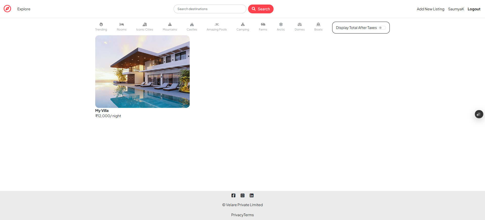
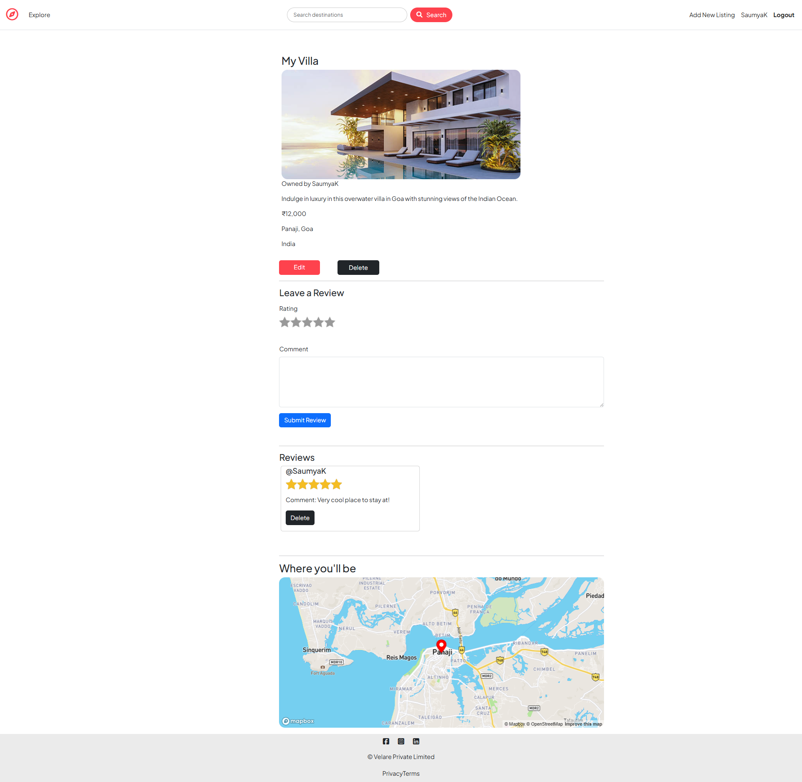
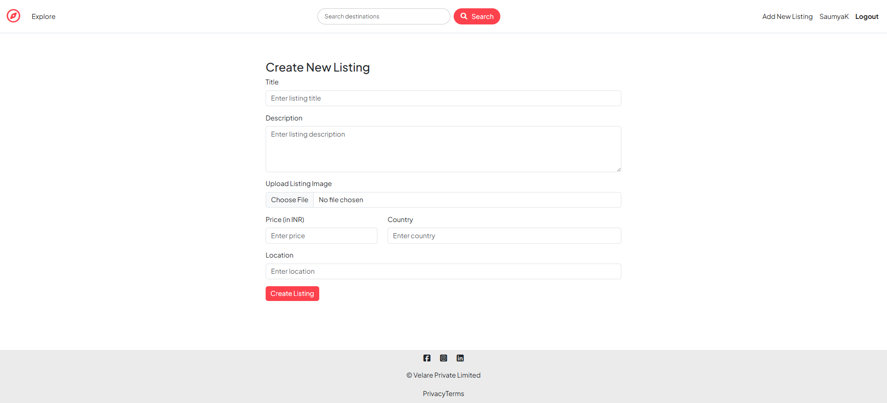
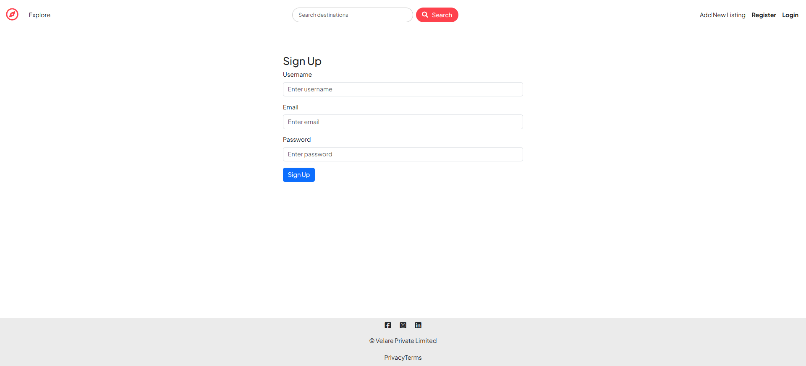

<div align="center">

# 🌍 Velare

### An Airbnb-inspired travel listing platform built to learn the MERN ecosystem.

**🔗 Live Demo:** https://velare-zeta.vercel.app

</div>

---

## 📖 About

Velare is a full-stack web application inspired by Airbnb, built as a learning project to gain hands-on experience with modern backend development using Node.js, Express, MongoDB, authentication, image uploads, and RESTful architecture.

The primary goal of this project was to understand how real-world web applications are structured and deployed, rather than to build a production-ready platform.

---

## ✨ Features

- User registration & login
- Authentication with Passport.js
- Session management
- Create, edit and delete listings
- Upload listing images with Cloudinary
- Leave reviews and ratings
- Interactive location maps using Mapbox
- Server-side validation with Joi
- Authorization for listings and reviews
- Flash messages and error handling
- Responsive UI built with Bootstrap

---

## 🛠 Tech Stack

### Backend
- Node.js
- Express.js
- MongoDB Atlas
- Mongoose

### Frontend
- EJS
- Bootstrap 5
- JavaScript

### Authentication
- Passport.js
- express-session

### Services
- Cloudinary
- Mapbox Geocoding API

### Validation & Utilities
- Joi
- Multer

---

## 🚀 Live Demo

https://velare-zeta.vercel.app

---

## 📸 Screenshots

### 🏠 Home Page

Browse featured stays and explore available listings.

<p align="center">
  
</p>

---

### 🏡 Listing Details

View property information, images, location, and user reviews.

<p align="center">
  
</p>

---

### ➕ Create a Listing

Hosts can add new listings with images, pricing, and location details.

<p align="flex-start">
  
</p>

---

### 🔐 User Authentication

Secure login and registration powered by Passport.js.

<p align="center">
  
</p>

---

## 🏃 Running Locally

```bash
git clone https://github.com/SaumyaKhobragade/Velare.git

cd Velare

npm install
```

Create a `.env` file:

```env
ATLASDB_URL=

SECRET=

CLOUD_NAME=

CLOUD_API_KEY=

CLOUD_API_SECRET=

MAP_TOKEN=
```

Run:

```bash
node app.js
```

---

## 📚 What I Learned

This project helped me understand:

- MVC architecture
- RESTful routing
- Authentication & Authorization
- MongoDB relationships
- Image storage with Cloudinary
- Session management
- Server-side validation
- Deploying Express applications
- Environment variables & production configuration

---

## 🚧 Future Improvements

Since this project was created primarily for learning purposes, there are no major feature updates planned.

Instead, I'm focusing on building larger and more technically challenging projects that demonstrate scalable architecture and modern development practices.

---

## 👨‍💻 Author

**Saumya Khobragade**

GitHub: https://github.com/SaumyaKhobragade

---

## ⭐ Acknowledgements

This project was built as part of my full-stack web development learning journey and is inspired by Airbnb-style travel listing platforms.